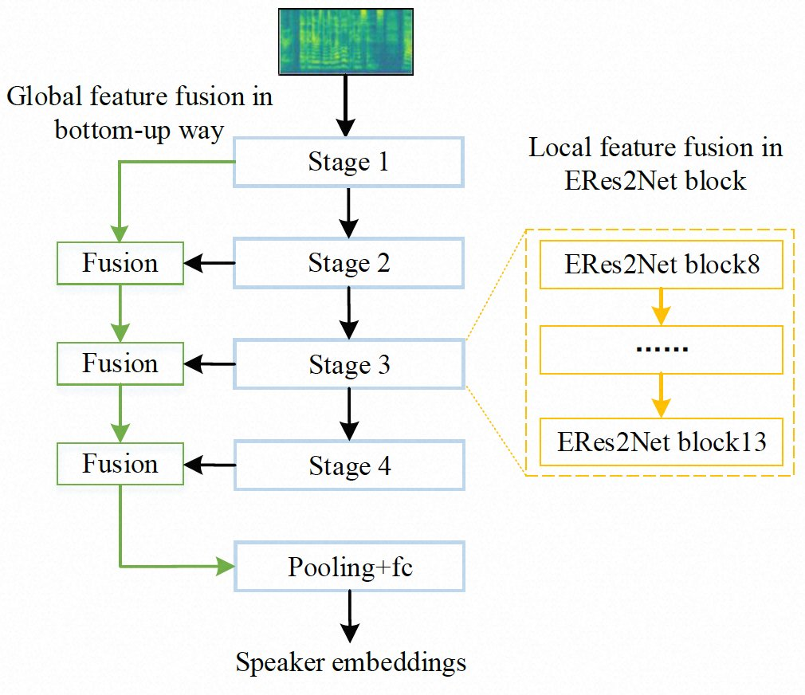

---
tasks:
- speaker-verification
model_type:
- ERes2Net
domain:
- audio
frameworks:
- pytorch
backbone:
- ERes2Net
license: Apache License 2.0
language:
- cn
tags:
- ERes2Net-Base
- INTERSPEECH 2023
- 3D-Speaker
widgets:
  - task: speaker-verification
    model_revision: v1.0.0
    inputs:
      - type: audio
        name: input
        title: 音频
    extendsParameters:
      thr: 0.249
    examples:
      - name: 1
        title: 示例1
        inputs:
          - name: enroll
            data: git://examples/speaker1_a_cn_16k.wav
          - name: input
            data: git://examples/speaker1_b_cn_16k.wav
      - name: 2
        title: 示例2
        inputs:
          - name: enroll
            data: git://examples/speaker1_a_cn_16k.wav
          - name: input
            data: git://examples/speaker2_a_cn_16k.wav
    inferencespec:
      cpu: 8 #CPU数量
      memory: 1024
---

## 3D-Speaker ERes2Net-Base 说话人识别模型
ERes2Net模型结合全局特征和局部特征，从而提高说话人识别性能。局部特征融合将一个单一残差块内的特征融合提取局部信号；全局特征融合使用不同层级输出的不同尺度声学特征聚合全局信号。ERes2Net-Base是参数量较小的ERes2Net模型，可实现快速训练和推理，在参数量为4.6M的条件下，在3D-Speaker各测试集中，识别性能超越ECAPA-TDNN。
## 模型简述
ERes2Net局部融合如下图黄色部分所示，使用Attentianal feature fusion阶梯式融合各分组特征来增强局部信息连接，获取更细粒度特征；全局融合如下图绿色部分所示，通过自底向上的全局特征融合来增强说话人信息。

<div align=center>

</div>

更详细的信息见
- ERes2Net论文：[An Enhanced Res2Net with Local and Global Feature Fusion for Speaker Verification](https://arxiv.org/abs/2305.12838)
- 3D-Speaker论文：[3D-Speaker: A Large-Scale Multi-Device, Multi-Distance, and Multi-Dialect Corpus for Speech Representation Disentanglement](https://arxiv.org/pdf/2306.15354.pdf)
- github项目地址：[3D-Speaker](https://github.com/alibaba-damo-academy/3D-Speaker)

## 训练数据
本模型使用达摩院开源数据集[3D-Speaker](https://3dspeaker.github.io/)数据集进行训练，包含约10k个说话人，可以对16k采样率的中文音频进行识别。
## 模型效果评估
在3D-Speaker中文测试集:Cross Device, Cross-Distance, Cross-Dialect中EER评测结果如下：
| Model | Params | Cross-Device | Cross-Distance | Cross-Dialect |
|:-----:|:------:| :------:|:------:|:------:|
| ECAPA-TDNN | 20.8M | 8.87% | 12.26% | 14.53% |
| CAM++ Base | 7.2M | 7.75% | 11.29% | 13.44% |
| ERes2Net Base | 4.6M | 7.21% | 10.18% | 12.52% |

## 在线体验 开发中...
在页面右侧，可以在“在线体验”栏内看到我们预先准备好的示例音频，点击播放按钮可以试听，点击“执行测试”按钮，会在下方“测试结果”栏中显示相似度得分(范围为[-1,1])和是否判断为同一个人。如果您想要测试自己的音频，可点“更换音频”按钮，选择上传或录制一段音频，完成后点击执行测试，识别内容将会在测试结果栏中显示。
## 在Notebook中体验
```python
from modelscope.pipelines import pipeline
sv_pipline = pipeline(
    task='speaker-verification',
    model='damo/speech_eres2net_base_sv_zh-cn_3dspeaker_16k',
    model_revision='v1.0.0'
)
speaker1_a_wav = 'https://modelscope.cn/api/v1/models/damo/speech_campplus_sv_zh-cn_16k-common/repo?Revision=master&FilePath=examples/speaker1_a_cn_16k.wav'
speaker1_b_wav = 'https://modelscope.cn/api/v1/models/damo/speech_campplus_sv_zh-cn_16k-common/repo?Revision=master&FilePath=examples/speaker1_b_cn_16k.wav'
speaker2_a_wav = 'https://modelscope.cn/api/v1/models/damo/speech_campplus_sv_zh-cn_16k-common/repo?Revision=master&FilePath=examples/speaker2_a_cn_16k.wav'
# 相同说话人语音
result = sv_pipline([speaker1_a_wav, speaker1_b_wav])
print(result)
# 不同说话人语音
result = sv_pipline([speaker1_a_wav, speaker2_a_wav])
print(result)
# 可以自定义得分阈值来进行识别
result = sv_pipline([speaker1_a_wav, speaker2_a_wav], thr=0.249)
print(result)
```
## 训练和测试自己的ERes2Net-Base模型
本项目已在[3D-Speaker](https://github.com/alibaba-damo-academy/3D-Speaker)开源了训练、测试和推理代码，使用者可按下面方式下载安装使用：
``` sh
git clone https://github.com/alibaba-damo-academy/3D-Speaker.git && cd 3D-Speaker
conda create -n 3D-Speaker python=3.8
conda activate 3D-Speaker
pip install -r requirements.txt
```

运行ERes2Net在VoxCeleb集上的训练脚本
``` sh
cd egs/3dspeaker/sv-eres2net
# 需要在run.sh中提前配置训练使用的GPU信息，默认是4卡
bash run.sh
```
## 使用本预训练模型快速提取embedding
``` sh
pip install modelscope
cd 3D-Speaker
# 配置模型名称并指定wav路径，wav路径可以是单个wav，也可以包含多条wav路径的list文件
model_id=damo/speech_eres2net_base_sv_zh-cn_3dspeaker_16k
# 提取embedding
python speakerlab/bin/infer_sv.py --model_id $model_id --wavs $wav_path
```

## 相关论文以及引用信息
如果你觉得这个该模型有所帮助，请引用下面的相关的论文
```BibTeX
@article{eres2net,
  title={An Enhanced Res2Net with Local and Global Feature Fusion for Speaker Verification},
  author={Yafeng Chen, Siqi Zheng, Hui Wang, Luyao Cheng, Qian Chen, Jiajun Qi},
  booktitle={Interspeech 2023},
  year={2023},
  organization={IEEE}
}
@inproceedings{chen2023pushing,
  title={3D-Speaker: A Large-Scale Multi-Device, Multi-Distance, and Multi-Dialect Corpus for Speech Representation Disentanglement},
  author={Siqi Zheng, Luyao Cheng, Yafeng Chen, Hui Wang and Qian Chen},
  url={https://arxiv.org/pdf/2306.15354.pdf},
  year={2023}
}
```

## 3D-Speaker 开发者社区钉钉群
<div align=left>

</div>


